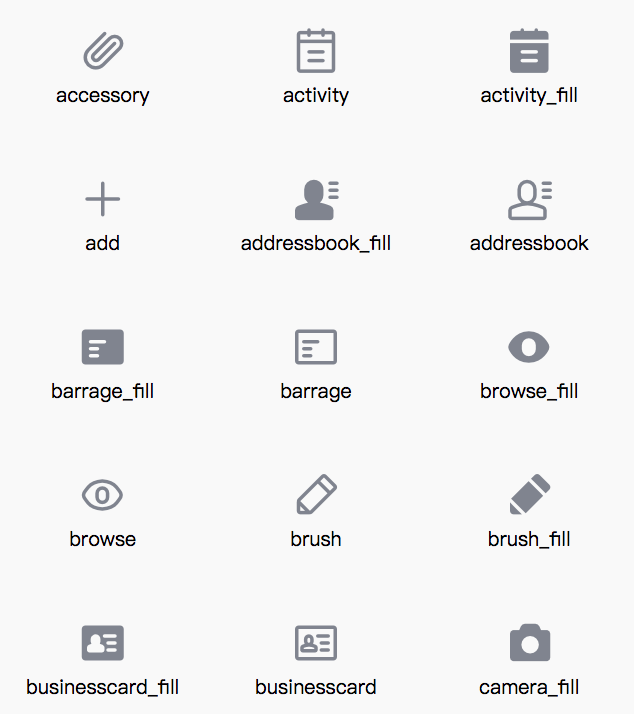
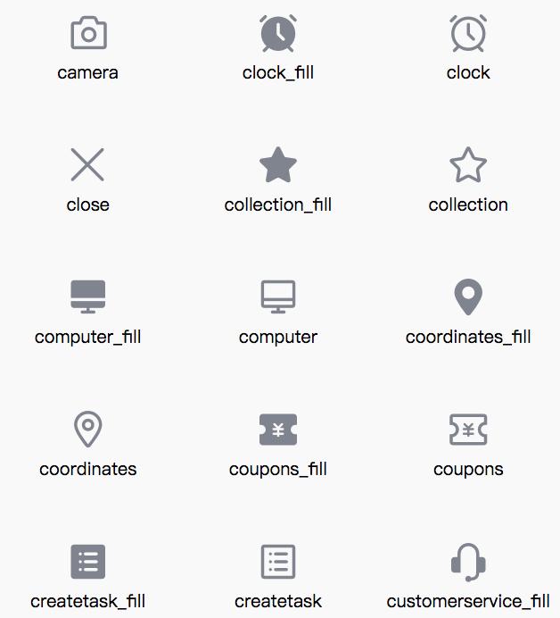
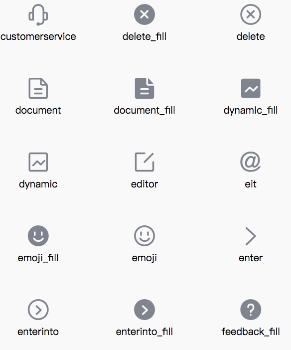

## Icon 图标

#### 使用指南

###### 在index.json中引入组件

<p class="tip" style="font-size: .85em;color: #6a737d;">
 tips: path/to是占位用的，填入你dist目录所有在位置即可
</p>

```json
{
  "usingComponents": {
    "air-icon": "path/to/dist/icon/index"
  }
}
```

#### 代码演示
```html
<air-icon type="add" size="100" color="yellowgreen"></air-icon>
```


#### 属性
名称 | 类型 | 是否必须 | 默认 | 描述
---|---|---|---|---|
type | String | 是 | 无 | icon样式,add,setup,share...
size | String | 否 | 14px | icon大小，默认14px
color | String | 否 | 无 | icon颜色，可填入符合css规则的样式

<!-- #### 支持以下type类型


 -->
